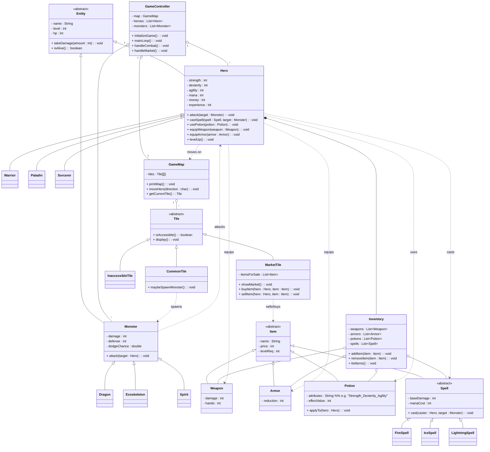

# CS 611 – Monsters and Heroes

### Jerin Joseph - U11191999

Turn-based, tile-based RPG inspired by classic party dungeon crawlers.  
The player controls a **party of heroes** moving together on a map, visiting **markets**, and fighting **monsters** in **turn-based battles**.

---

## Main File / Folder Contents

### 1. `src/` root

All Java source files live under `src`, grouped by package according to responsibility.

---

### 2. `Common/`

Reusable infrastructure and building blocks that are **not tied** to this specific game.

#### 2.1 `Common/AbstractClasses/`

- **`Character`**
    - Abstract base class for any entity with HP, level, id, and a type.
    - Implemented by:
        - `Hero.Hero`
        - `Monster.Monster`
    - Fields (conceptually):
        - `id`, `name`, `level`, `HP`, `CharacterType type`
    - Key responsibilities:
        - Provide a common interface for all “living” entities.
        - Enable polymorphism in battle and utilities (e.g., printing stats).

- **`Item`**
    - Abstract base for all items that can be held/bought/used.
    - Extended by:
        - `Item.Weapon`
        - `Item.Armor`
        - `Item.Potion`
        - `Item.Spell`
    - Common fields:
        - `name`, `price`, `requiredLevel`, `itemType`

#### 2.2 `Common/utils/`

- **`Helper`**
    - Utility functions used across the project:
        - Input helpers (`readIntInRange`, etc.)
        - ID generation
        - Display helpers (show hero info, inventory, etc.)
    - Centralizes shared logic and avoids duplication.

- **Enums**
    - `CharacterType` – HERO, MONSTER, etc.
    - `HeroType` – WARRIOR, SORCERER, PALADIN.
    - `MonsterType` – DRAGON, EXOSKELETON, SPIRIT.
    - `AttributeType` – HEALTH, MANA, STRENGTH, DEXTERITY, AGILITY.
    - `SpellType` – ICE, FIRE, LIGHTNING.
    - These enums give strong typing and make the code self-documenting.

#### 2.3 `Common/Catalog/`

- **`MonsterCatalog`** (e.g., `DragonCatalog`, `ExoskeletonCatalog`, `SpiritCatalog`)
    - Enum-based catalogs containing pre-defined monsters (name, level, damage, defense, dodge).
    - Used by `Battle` to spawn monsters matching the party’s level.
- **`ItemCatalog`** (e.g., `WeaponCatalog`, etc., if present)
    - Enum-based catalogs for items with static stats.
    - Used by `Hero` and `Market` to initialize default weapons or shop items.

Catalogs make it easy to add new monsters / items without changing core logic.

---

### 3. `Hero/`

- **`Hero`**
    - Extends `Character`.
    - Represents a controllable hero in the party.
    - Fields:
        - `HP_MAX`, `MP`, `MP_MAX`
        - `strengthValue`, `dexterityValue`, `agilityValue`, `defenseValue`
        - `totalGold`, `experiencePoints`
        - `HeroType heroType`
        - `Inventory inventory`
        - `Weapon equippedWeapon`
        - `Armor equippedArmor`
    - Responsibilities:
        - Store all combat-relevant stats.
        - Manage equipment and inventory.
        - Track leveling, HP/MP caps, and gold.

---

### 4. `Monster/`

- **`Monster`**
    - Extends `Character`.
    - Represents an enemy unit in battle.
    - Fields:
        - `baseDamageValue`, `defenseValue`, `dodgeAbilityValue`
        - `MonsterType monsterType`
    - Responsibilities:
        - Provide stats for battle calculations.
        - Encapsulate monster-specific attributes and scaling.

---

### 5. `Inventory/`

- **`Inventory`**
    - Container owned by a `Hero`.
    - Fields (conceptually):
        - Lists of `Weapon`, `Armor`, `Potion`, and `Spell`
    - Responsibilities:
        - Add/remove items.
        - Provide getters used by `Battle` and `Market` when choosing equipment, potions, and spells.

---

### 6. `Item/`

- **`Weapon`**
    - Extends `Item`.
    - Fields:
        - `damageValue`, `handsRequired`
    - Used by heroes to increase physical attack damage.

- **`Armor`**
    - Extends `Item`.
    - Field:
        - `damageReduction`
    - Reduces incoming physical damage in `Battle`.

- **`Potion`**
    - Extends `Item`.
    - Fields:
        - `effectAmountValue`
        - `List<AttributeType> attributes` – which stats to buff.
    - Used in battle to increase HP/MP or stats like strength/dexterity/agility.

- **`Spell`**
    - Extends `Item`.
    - Fields:
        - `damageValue`, `manaCost`, `SpellType spellType`
    - Deals magical damage plus a side-effect debuff on monsters:
        - ICE → lowers damage
        - FIRE → lowers defense
        - LIGHTNING → lowers dodge chance

---

### 7. `Player/`

- **`Player`**
    - Represents the *human* player controlling a **party**.
    - Fields:
        - `String name`
        - `List<Hero> heroes`
        - `Position currentPosition` (on the map)
    - Responsibilities:
        - Track the party’s location.
        - Store and manage heroes acting as a cohesive group.

---

### 8. `Map/` & `Tile/`

- **`Map`**
    - Holds the world grid of tiles.
    - Fields:
        - `Tile[][] tiles`
        - Config probabilities: `blockProbability`, `marketProbability`
        - Starting `Position`
    - Responsibilities:
        - Generate a valid map with:
            - INACCESSIBLE tiles (blocked)
            - MARKET tiles
            - COMMON tiles (can trigger battles)
        - Ensure map connectivity (player can reach accessible tiles).
        - Expose:
            - `updatePlayerCurrentPosition(Position newPos)` – validates movement.
            - `getPlayerMapTileType()` – get tile type for player’s current position.
            - `getMarketAt(Position)` – returns the `Market` for a market tile.
            - A `displayMap()` function (to print the map with the player on it).

- **`Tile`**
    - Represents a single map cell.
    - Fields:
        - `MapTileType type` (INACCESSIBLE, MARKET, COMMON)
        - `Position position`
        - Optional `Market market`
    - Responsibilities:
        - Encapsulate tile behavior and metadata.

- **`Position`**
    - Simple value object for `(row, col)` positions on the map.
    - Used by `Player`, `Map`, and `Tile`.

---

### 9. `Market/`

- **`Market`**
    - Represents a shop located on specific tiles.
    - Fields:
        - `List<Item> items` (available for sale)
    - Key method:
        - `openMarket(Scanner sc, ArrayList<Hero> party)`
            - Lets the player:
                - Select a hero.
                - Buy items (checking level + gold).
                - Sell items (returning half price).
                - View hero inventory.
    - Responsibilities:
        - Encapsulate **buy/sell** logic.
        - Centralize rules for gold, level requirements, and stock.

---

### 10. `Battle/`

- **`Battle`**
    - Orchestrates **turn-based combat** between:
        - A hero party (`List<Hero>`)
        - A team of monsters (`List<Monster>`)
    - Fields:
        - `ArrayList<Hero> heroes`
        - `ArrayList<Monster> monsters`
        - `HashMap<Hero, Monster> rivalMap` – initial pairing hero ↔ monster
        - `Random random`
    - Key responsibilities:
        - Set up monsters level-matched to the heroes using `MonsterCatalog`.
        - Determine when a battle is triggered: `isBattleTriggered(double battleProb)`.
        - Run the combat loop: `arenaFight()`
            - Each hero’s turn:
                - Attack
                - Cast spell
                - Use potion
                - Equip weapon/armor
                - Skip
            - Each monster’s turn:
                - Attack a hero using monster stats.
            - Apply dodging, armor reduction, spell debuffs.
            - Regenerate small amounts of HP/MP each round.
            - After victory:
                - Gold/XP reward and revive fallen heroes (with partial HP/MP).

---

### 11. `Game/` & `Main/`

- **`Game`**
    - High-level **game orchestrator**.
    - Responsibilities:
        - Prompt for player name and map configuration (rows, columns, probabilities).
        - Let player choose party size and hero types (warrior / sorcerer / paladin).
        - Create the `Map`, `Player`, and initial state.
        - Main loop:
            - Show map.
            - Read command:
                - Movement (`W/A/S/D`)
                - Show info / inventory
                - Enter market (`M`) if on a market tile.
                - Quit (`Q`)
            - On valid movement to a COMMON tile:
                - Randomly trigger a `Battle` using `Battle.isBattleTriggered(battleProb)`.

- **`Main`**
    - Entry point of the whole project.
    - Typical usage:
      ```java
      public static void main(String[] args) {
          Game game = new Game();
          game.launchGame();
      }
      ```

---

## Run Steps

1. Import the project into **IntelliJ IDEA** (or another Java IDE).
2. Ensure **Java 8** is configured (e.g., Corretto 1.8).
3. Set the run configuration main class to **`Main`** (or `main.Main` depending on your package).
4. Run the application:
    - Choose map size and probabilities.
    - Create your party.
    - Move around, fight monsters, and visit markets.

---

## High-Level Design & Use Cases

### Game Flow

1. **Setup phase**
    - Player chooses:
        - Map size and probabilities for:
            - Inaccessible tiles
            - Market tiles
            - Battle encounters
        - Number and type of heroes.
    - `Game` constructs:
        - `Player`
        - `Map`
        - Initial heroes and their inventories.

2. **Exploration phase**
    - Player inputs movement commands.
    - `Game` uses `Map.updatePlayerCurrentPosition()` to validate moves:
        - Reject moves off the map or into inaccessible tiles.
    - Depending on tile type:
        - `COMMON` → possible battle (probability).
        - `MARKET` → call `Market.openMarket(...)`.
        - `INACCESSIBLE` → movement disallowed.

3. **Battle phase**
    - `Game` invokes `new Battle(party).arenaFight()`.
    - `Battle`:
        - Spawns level-appropriate monsters from catalogs.
        - Runs alternating hero/monster turns until one side is defeated.
        - Updates hero stats, XP, and gold.

4. **Shopping phase**
    - When on a market tile:
        - Player can:
            - Buy better weapons/armor/spells/potions.
            - Sell unused items.
            - Inspect inventories and hero stats.

---

## Scalability & Extensibility

This design deliberately supports adding **new content** and **new rules** with minimal changes:

### 1. Abstract Base Classes

- `Character` and `Item` capture shared behavior:
    - Any new hero/monster type or item automatically fits into existing systems.
- `Hero` and `Monster` extend `Character` and add only their unique stats.

**Benefits:**
- Polymorphic handling in `Battle`, `Helper`, and other utilities.
- Shared functions (like printing, HP handling) live in one place.

---

### 2. Catalog-based Data

- Monsters and (optionally) items are defined via **catalog enums**:
    - `DragonCatalog`, `ExoskeletonCatalog`, `SpiritCatalog`, etc.
- To add a new monster:
    - Add an entry in the catalog enum with its stats.
    - `Battle.setupMonsters()` automatically can use it with no logic changes.

**Benefits:**
- Easy content additions.
- Keeps game logic decoupled from specific monsters/items.

---

### 3. Modularity by Responsibility

- **Battle** only knows about:
    - Heroes, monsters, inventory/equipment, and combat rules.
- **Map** only knows about:
    - Tile types, connectivity, and valid movement.
- **Market** only knows about:
    - Item buying/selling, checking levels and gold.
- **Game** orchestrates:
    - High-level flow, user input, and ties systems together.

**Benefits:**
- Each component can evolve independently.
- Changing battle rules doesn’t touch map/market.
- Reusing `Map` + `Market` + `Battle` in another game becomes feasible.

---

### 4. Strong Typing via Enums

- Using enums for types (`HeroType`, `MonsterType`, `AttributeType`, `SpellType`) avoids:
    - Magic strings
    - Typos and inconsistent values
- Makes switch-based logic clear and compiler-checked.

**Benefits:**
- Safer refactors.
- Self-documenting code.

---

### 5. Future Extensions

Some natural extensions the design already supports:

- **New hero classes** (e.g., Ranger, Cleric) with different stat scaling.
- **New tile types** (e.g., teleport tiles, safe zones).
- **Status effects** (poison, stun) by extending spells or adding buff/debuff classes.
- **Multiple maps / dungeons** by encapsulating map generation strategies.

Most of these can be added by:
- New enum entries,
- New subclasses of existing abstractions,
- Or small additions to `Battle` and `Map` without affecting `Game` or `Market` logic.

---

## UML Class Diagram

Below is a **high-level UML** diagram (Mermaid syntax) showing the main classes and their relationships.



## Run Example

Below is a sample output of how the game would look like.

```bash
    WELCOME TO MONSTERS AND HEROES

Enter your name: Jerin Joseph

========= MAP CONFIGURATIONS =========
Enter the dimensions of the world map.
Rows: 8
Columns: 8

Now enter certain configurations for different features in the map
Battle Probability [0-1] [Default 0.4]: 
Inaccessible Tile Probability [0-1] [Default 0.2]: 
Market Probability [0-1] [Default 0.3]: 

========= HERO CONFIGURATIONS =========
Select the number of heroes in your party: 1

===== HERO 0 =====
Enter the type of hero 0 [Default WARRIOR - 0]: 
WARRIOR  - 0
SORCERER - 1
PALADIN  - 2
Your choice (0-2): 2
Choose a paladin type hero:
[0] Name: Parzival | Mana: 300 | Strength: 750 | Agility: 650 | Dexterity: 700 | Starting Money: 2500 | Starting Experience: 7 
[1] Name: Sehanine Moonbow | Mana: 300 | Strength: 750 | Agility: 700 | Dexterity: 700 | Starting Money: 2500 | Starting Experience: 7 
[2] Name: Skoraeus Stonebones | Mana: 250 | Strength: 650 | Agility: 600 | Dexterity: 350 | Starting Money: 2500 | Starting Experience: 4 
[3] Name: Garl Glittergold | Mana: 100 | Strength: 600 | Agility: 500 | Dexterity: 400 | Starting Money: 2500 | Starting Experience: 5 
[4] Name: Amaryllis Astra | Mana: 500 | Strength: 500 | Agility: 500 | Dexterity: 500 | Starting Money: 2500 | Starting Experience: 5 
[5] Name: Caliber Heist | Mana: 400 | Strength: 400 | Agility: 400 | Dexterity: 400 | Starting Money: 2500 | Starting Experience: 8 
Your choice: 4

Now finally enter the initial position of the player:
Start row [0-7] [Default is 4]: 
Start col [0-7] [Default is 4]: 

=========GAMES STARTED=========
=================== WORLD MAP ===================

+=====+=====+=====+=====+=====+=====+=====+=====+
|  X  |  X  |  _  |  _  |  _  |  _  |  M  |  _  |
+=====+=====+=====+=====+=====+=====+=====+=====+
|  M  |  _  |  M  |  M  |  _  |  _  |  M  |  _  |
+=====+=====+=====+=====+=====+=====+=====+=====+
|  _  |  _  |  _  |  M  |  _  |  _  |  _  |  _  |
+=====+=====+=====+=====+=====+=====+=====+=====+
|  _  |  M  |  X  |  M  |  _  |  M  |  _  |  M  |
+=====+=====+=====+=====+=====+=====+=====+=====+
|  M  |  X  |  _  |  X  |  P  |  M  |  M  |  X  |
+=====+=====+=====+=====+=====+=====+=====+=====+
|  _  |  _  |  M  |  M  |  M  |  _  |  _  |  X  |
+=====+=====+=====+=====+=====+=====+=====+=====+
|  X  |  _  |  _  |  _  |  M  |  _  |  X  |  X  |
+=====+=====+=====+=====+=====+=====+=====+=====+
|  _  |  M  |  _  |  _  |  _  |  M  |  _  |  M  |
+=====+=====+=====+=====+=====+=====+=====+=====+
Enter a choice:
Move [w -> up | a -> left | s -> down | d -> right]: 
Enter Market [M]: 
Show inventory [I]: 
Show player stats [P]: 
Quit [Q]: 
Your choice: w
=================== WORLD MAP ===================

+=====+=====+=====+=====+=====+=====+=====+=====+
|  X  |  X  |  _  |  _  |  _  |  _  |  M  |  _  |
+=====+=====+=====+=====+=====+=====+=====+=====+
|  M  |  _  |  M  |  M  |  _  |  _  |  M  |  _  |
+=====+=====+=====+=====+=====+=====+=====+=====+
|  _  |  _  |  _  |  M  |  _  |  _  |  _  |  _  |
+=====+=====+=====+=====+=====+=====+=====+=====+
|  _  |  M  |  X  |  M  |  P  |  M  |  _  |  M  |
+=====+=====+=====+=====+=====+=====+=====+=====+
|  M  |  X  |  _  |  X  |  M  |  M  |  M  |  X  |
+=====+=====+=====+=====+=====+=====+=====+=====+
|  _  |  _  |  M  |  M  |  M  |  _  |  _  |  X  |
+=====+=====+=====+=====+=====+=====+=====+=====+
|  X  |  _  |  _  |  _  |  M  |  _  |  X  |  X  |
+=====+=====+=====+=====+=====+=====+=====+=====+
|  _  |  M  |  _  |  _  |  _  |  M  |  _  |  M  |
+=====+=====+=====+=====+=====+=====+=====+=====+
Enter a choice:
Move [w -> up | a -> left | s -> down | d -> right]: 
Show inventory [I]: 
Show player stats [P]: 
Quit [Q]: 
Your choice: w
=================== WORLD MAP ===================

+=====+=====+=====+=====+=====+=====+=====+=====+
|  X  |  X  |  _  |  _  |  _  |  _  |  M  |  _  |
+=====+=====+=====+=====+=====+=====+=====+=====+
|  M  |  _  |  M  |  M  |  _  |  _  |  M  |  _  |
+=====+=====+=====+=====+=====+=====+=====+=====+
|  _  |  _  |  _  |  M  |  P  |  _  |  _  |  _  |
+=====+=====+=====+=====+=====+=====+=====+=====+
|  _  |  M  |  X  |  M  |  _  |  M  |  _  |  M  |
+=====+=====+=====+=====+=====+=====+=====+=====+
|  M  |  X  |  _  |  X  |  M  |  M  |  M  |  X  |
+=====+=====+=====+=====+=====+=====+=====+=====+
|  _  |  _  |  M  |  M  |  M  |  _  |  _  |  X  |
+=====+=====+=====+=====+=====+=====+=====+=====+
|  X  |  _  |  _  |  _  |  M  |  _  |  X  |  X  |
+=====+=====+=====+=====+=====+=====+=====+=====+
|  _  |  M  |  _  |  _  |  _  |  M  |  _  |  M  |
+=====+=====+=====+=====+=====+=====+=====+=====+
Enter a choice:
Move [w -> up | a -> left | s -> down | d -> right]: 
Show inventory [I]: 
Show player stats [P]: 
Quit [Q]: 
Your choice: w
=================== WORLD MAP ===================

+=====+=====+=====+=====+=====+=====+=====+=====+
|  X  |  X  |  _  |  _  |  _  |  _  |  M  |  _  |
+=====+=====+=====+=====+=====+=====+=====+=====+
|  M  |  _  |  M  |  M  |  P  |  _  |  M  |  _  |
+=====+=====+=====+=====+=====+=====+=====+=====+
|  _  |  _  |  _  |  M  |  _  |  _  |  _  |  _  |
+=====+=====+=====+=====+=====+=====+=====+=====+
|  _  |  M  |  X  |  M  |  _  |  M  |  _  |  M  |
+=====+=====+=====+=====+=====+=====+=====+=====+
|  M  |  X  |  _  |  X  |  M  |  M  |  M  |  X  |
+=====+=====+=====+=====+=====+=====+=====+=====+
|  _  |  _  |  M  |  M  |  M  |  _  |  _  |  X  |
+=====+=====+=====+=====+=====+=====+=====+=====+
|  X  |  _  |  _  |  _  |  M  |  _  |  X  |  X  |
+=====+=====+=====+=====+=====+=====+=====+=====+
|  _  |  M  |  _  |  _  |  _  |  M  |  _  |  M  |
+=====+=====+=====+=====+=====+=====+=====+=====+
Enter a choice:
Move [w -> up | a -> left | s -> down | d -> right]: 
Show inventory [I]: 
Show player stats [P]: 
Quit [Q]: 
Your choice: a
=================== WORLD MAP ===================

+=====+=====+=====+=====+=====+=====+=====+=====+
|  X  |  X  |  _  |  _  |  _  |  _  |  M  |  _  |
+=====+=====+=====+=====+=====+=====+=====+=====+
|  M  |  _  |  M  |  P  |  _  |  _  |  M  |  _  |
+=====+=====+=====+=====+=====+=====+=====+=====+
|  _  |  _  |  _  |  M  |  _  |  _  |  _  |  _  |
+=====+=====+=====+=====+=====+=====+=====+=====+
|  _  |  M  |  X  |  M  |  _  |  M  |  _  |  M  |
+=====+=====+=====+=====+=====+=====+=====+=====+
|  M  |  X  |  _  |  X  |  M  |  M  |  M  |  X  |
+=====+=====+=====+=====+=====+=====+=====+=====+
|  _  |  _  |  M  |  M  |  M  |  _  |  _  |  X  |
+=====+=====+=====+=====+=====+=====+=====+=====+
|  X  |  _  |  _  |  _  |  M  |  _  |  X  |  X  |
+=====+=====+=====+=====+=====+=====+=====+=====+
|  _  |  M  |  _  |  _  |  _  |  M  |  _  |  M  |
+=====+=====+=====+=====+=====+=====+=====+=====+
Enter a choice:
Move [w -> up | a -> left | s -> down | d -> right]: 
Enter Market [M]: 
Show inventory [I]: 
Show player stats [P]: 
Quit [Q]: 
Your choice: m

===== MARKET =====

Choose a hero to trade with (or 0 to leave market):
[1] Amaryllis Astra (Level 1, Gold: 2500)
Your choice: 1

--- Trading with Amaryllis Astra (Level 1, Gold: 2500) ---
[1] Buy items
[2] Sell items
[3] Show hero inventory
[4] Back to hero selection
Your choice: 1

--- Items available to buy ---
[1] Dagger          | Type: WEAPON     | Price:  200 | Level: 1
[2] Dagger          | Type: WEAPON     | Price:  200 | Level: 1
[3] Ambrosia        | Type: POTION     | Price: 1000 | Level: 8
[4] Frost_Blizzard  | Type: SPELL      | Price:  750 | Level: 5
[0] Back
Choose item to buy: 1
Bought Dagger for 200 gold.

--- Items available to buy ---
[1] Dagger          | Type: WEAPON     | Price:  200 | Level: 1
[2] Ambrosia        | Type: POTION     | Price: 1000 | Level: 8
[3] Frost_Blizzard  | Type: SPELL      | Price:  750 | Level: 5
[0] Back
Choose item to buy: 0

--- Trading with Amaryllis Astra (Level 1, Gold: 2300) ---
[1] Buy items
[2] Sell items
[3] Show hero inventory
[4] Back to hero selection
Your choice: 4

Choose a hero to trade with (or 0 to leave market):
[1] Amaryllis Astra (Level 1, Gold: 2300)
Your choice: 0
Leaving market...
=================== WORLD MAP ===================

+=====+=====+=====+=====+=====+=====+=====+=====+
|  X  |  X  |  _  |  _  |  _  |  _  |  M  |  _  |
+=====+=====+=====+=====+=====+=====+=====+=====+
|  M  |  _  |  M  |  P  |  _  |  _  |  M  |  _  |
+=====+=====+=====+=====+=====+=====+=====+=====+
|  _  |  _  |  _  |  M  |  _  |  _  |  _  |  _  |
+=====+=====+=====+=====+=====+=====+=====+=====+
|  _  |  M  |  X  |  M  |  _  |  M  |  _  |  M  |
+=====+=====+=====+=====+=====+=====+=====+=====+
|  M  |  X  |  _  |  X  |  M  |  M  |  M  |  X  |
+=====+=====+=====+=====+=====+=====+=====+=====+
|  _  |  _  |  M  |  M  |  M  |  _  |  _  |  X  |
+=====+=====+=====+=====+=====+=====+=====+=====+
|  X  |  _  |  _  |  _  |  M  |  _  |  X  |  X  |
+=====+=====+=====+=====+=====+=====+=====+=====+
|  _  |  M  |  _  |  _  |  _  |  M  |  _  |  M  |
+=====+=====+=====+=====+=====+=====+=====+=====+
Enter a choice:
Move [w -> up | a -> left | s -> down | d -> right]: 
Enter Market [M]: 
Show inventory [I]: 
Show player stats [P]: 
Quit [Q]: 
Your choice: w
BATTLE STARTS!

===== HEROES =====
Amaryllis Astra - HP: 100.00/100.00, MP: 500.00/500.00, Level: 1, Gold: 2300, EXP: 5

===== MONSTERS =====
Blinky - HP: 100.00, Level: 1, Damage: 450.00, Defense: 350.00, Dodge: 35.00

Amaryllis Astras turn
Choose an action:
1 - Attack
2 - Cast Spell
3 - Use Potion
4 - Equip Weapon/Armor
5 - Skip
Your choice: 1
Choose a monster to target:
[0] Blinky (HP: 100.00)
Your choice: 0
Amaryllis Astra dealt 47.50 damage to Blinky.
Amaryllis Astra dodged the attack!

===== HEROES =====
Amaryllis Astra - HP: 100.00/100.00, MP: 500.00/500.00, Level: 1, Gold: 2300, EXP: 5

===== MONSTERS =====
Blinky - HP: 62.50, Level: 1, Damage: 450.00, Defense: 350.00, Dodge: 35.00

Amaryllis Astras turn
Choose an action:
1 - Attack
2 - Cast Spell
3 - Use Potion
4 - Equip Weapon/Armor
5 - Skip
Your choice: 1
Choose a monster to target:
[0] Blinky (HP: 62.50)
Your choice: 0
Amaryllis Astra dealt 47.50 damage to Blinky.
Amaryllis Astra dodged the attack!

===== HEROES =====
Amaryllis Astra - HP: 100.00/100.00, MP: 500.00/500.00, Level: 1, Gold: 2300, EXP: 5

===== MONSTERS =====
Blinky - HP: 25.00, Level: 1, Damage: 450.00, Defense: 350.00, Dodge: 35.00

Amaryllis Astras turn
Choose an action:
1 - Attack
2 - Cast Spell
3 - Use Potion
4 - Equip Weapon/Armor
5 - Skip
Your choice: 1
Choose a monster to target:
[0] Blinky (HP: 25.00)
Your choice: 0
Amaryllis Astra dealt 47.50 damage to Blinky.
All monsters have been defeated. You win!
=================== WORLD MAP ===================

+=====+=====+=====+=====+=====+=====+=====+=====+
|  X  |  X  |  _  |  P  |  _  |  _  |  M  |  _  |
+=====+=====+=====+=====+=====+=====+=====+=====+
|  M  |  _  |  M  |  M  |  _  |  _  |  M  |  _  |
+=====+=====+=====+=====+=====+=====+=====+=====+
|  _  |  _  |  _  |  M  |  _  |  _  |  _  |  _  |
+=====+=====+=====+=====+=====+=====+=====+=====+
|  _  |  M  |  X  |  M  |  _  |  M  |  _  |  M  |
+=====+=====+=====+=====+=====+=====+=====+=====+
|  M  |  X  |  _  |  X  |  M  |  M  |  M  |  X  |
+=====+=====+=====+=====+=====+=====+=====+=====+
|  _  |  _  |  M  |  M  |  M  |  _  |  _  |  X  |
+=====+=====+=====+=====+=====+=====+=====+=====+
|  X  |  _  |  _  |  _  |  M  |  _  |  X  |  X  |
+=====+=====+=====+=====+=====+=====+=====+=====+
|  _  |  M  |  _  |  _  |  _  |  M  |  _  |  M  |
+=====+=====+=====+=====+=====+=====+=====+=====+
Enter a choice:
Move [w -> up | a -> left | s -> down | d -> right]: 
Show inventory [I]: 
Show player stats [P]: 
Quit [Q]: 
Your choice: q
Game Exited!!
```
    
